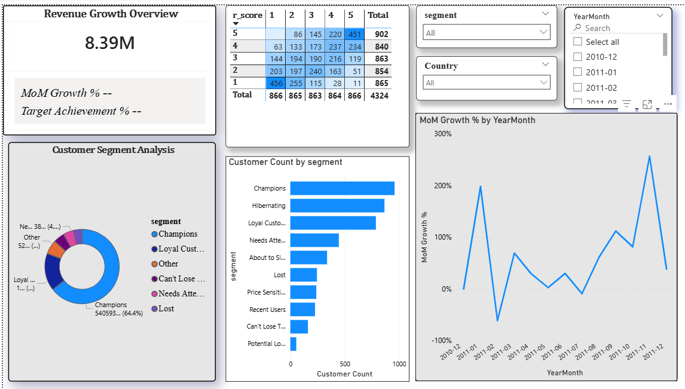

# Customer Segmentation & CLV Analytics Pipeline
This project builds an end-to-end data pipeline for Customer Segmentation and Customer Lifetime Value (CLV) analysis using Python, SQL, and Power BI. The system performs automated weekly data processing and dashboard refresh.

⚠️ Huge dataset not included in repo due to size constraints.

## Setup Database with Data

1. Download the raw CSV file from shared location: [CSV dataset download](https://www.kaggle.com/datasets/vijayuv/onlineretail?resource=download)

2. Place the CSV in path:  
   ` C:\Customer_Segmentation_CLV_Engine_Project\raw_dataset\OnlineRetail.csv`
   
## Project Workflow
1. Raw csv dataset downloaded from koggle
2. Data stored in sql database and cleaned 
3. Python used for RFM customer segmentation and market basket analysis
4. Cleaned & Segmented data loaded into power BI
5. Dashboard created with KPI cards ,iteractive visuals and filters
6. Python automation script refreshes the dashboard weekly

## Tools
1. sql
2. python
3. powerbi
4. Windows Task Scheduler (Automation)

## Python Environment Setup
A virtual environment (`venv`)was created to manage dependencies and ensure reproducibility
### steps to setup
**create a virtual environment**:
```bash
  python -m venv venv
  ```
**Activate the virtual environment**:
on windows
```bash
venv\Scripts\activate
```
**Install required packages**:
```bash
pip install -r requirements.txt
```
## Automation
A Python automation script is scheduled using Windows Task Scheduler to run weekly.

## Dashboard

